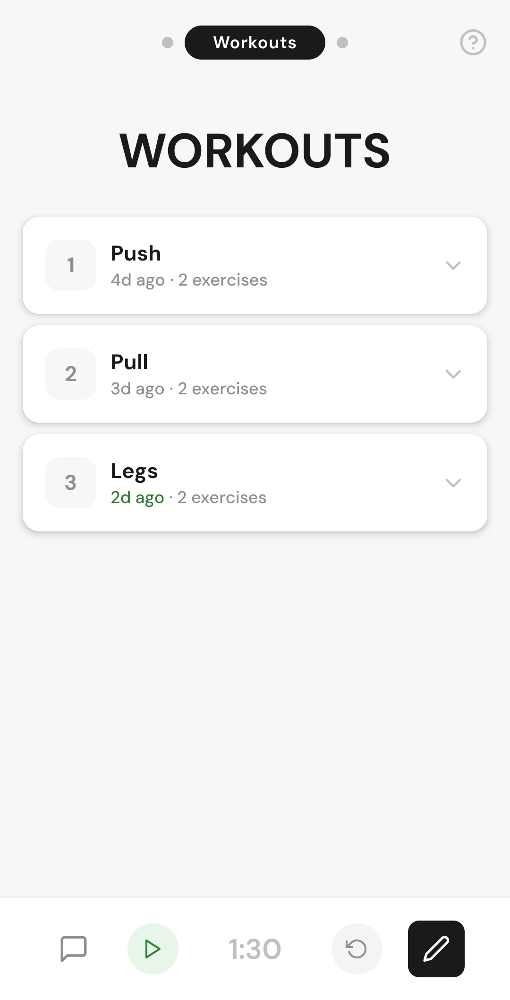
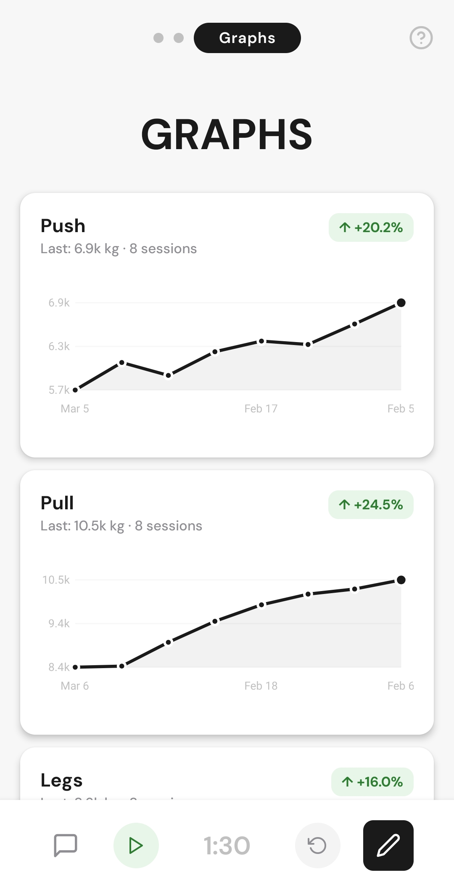
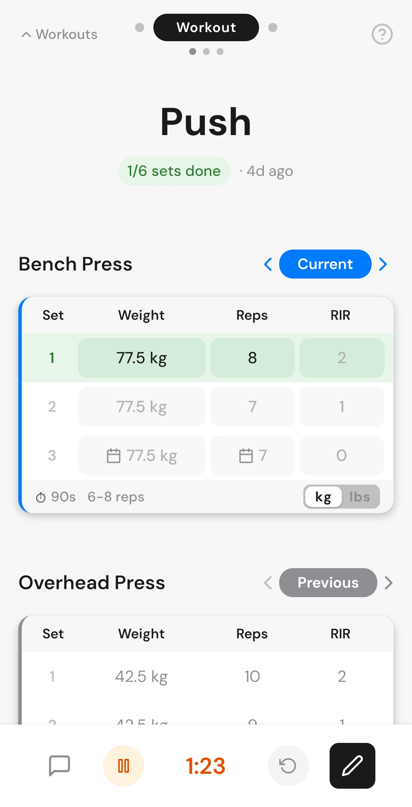
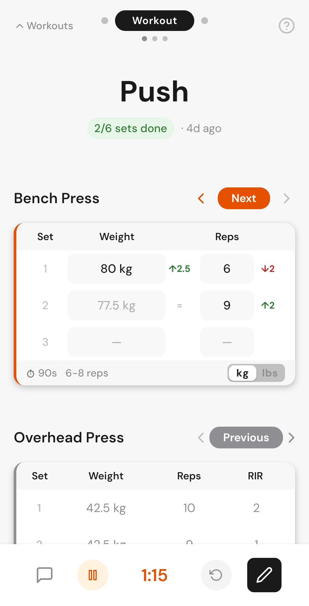

# Push — Workout Tracker


A minimalist workout tracking app. Spreadsheet flexibility, clean mobile UI.

## Why

Every workout app I've tried falls into one of two categories: over-engineered with features I don't need, or too rigid to match how I actually train. I always end up back on spreadsheets — flexible but painful on a phone.

Push is the middle ground: a clean, fast interface that adapts to any program structure without getting in the way.

## Screenshots


   


## Features

- **Programs → Workouts → Exercises** hierarchy — supports any training structure
- **Previous / Current / Next** views per exercise with swipe navigation
- **Pre-filled sets** from your last session (gray) or planned values (calendar icon)
- **Session rotation** — complete a workout, and data shifts automatically on next launch
- **Tonnage graphs** — track volume progression over time per exercise
- **Rest timer** — integrated countdown, starts automatically on set completion
- **Edit mode** — add/remove/rename exercises, sets, workouts, programs inline
- **Onboarding carousel** — first-launch walkthrough with skip option
- **Persistent storage** — AsyncStorage with per-program JSON, survives app restarts

## Architecture

```
src/
├── components/       # UI components (exercise, workout, graph, common)
├── context/          # DataContext — centralized state + AsyncStorage persistence
├── data/             # Starter program, mock data
├── hooks/            # Rest timer, slide transitions, persisted state
├── screens/          # MainScreen, WorkoutScreen
└── theme/            # Design tokens (colors, spacing, typography, shadows)
```

Key design decisions:
- **DataContext** owns all state and persistence. Components are pure presentation.
- **Per-program JSON** in AsyncStorage — programs load/save independently.
- **Session rotation** runs atomically at app launch across all programs.
- **No UI library** — custom design system built from scratch for full control.

## Tech Stack

- React Native (Expo, SDK 54)
- AsyncStorage for local persistence
- react-native-keyboard-aware-scroll-view
- Custom component library (no NativeBase, no UI kit)

## Run in Development

```bash
git clone https://github.com/hturlet/push-workout-app.git
cd push-workout-app
npm install
npx expo start
```

Scan the QR code with Expo Go (iOS/Android) or press `a` for Android emulator.

## Build & Install

### Android — Standalone APK

Push can be built as a standalone APK and installed on any Android device.

**Prerequisites:** a free [Expo](https://expo.dev/signup) account.

```bash
# Install EAS CLI (one-time)
npm install -g eas-cli

# Log in to your Expo account
eas login

# Build the APK (compiles in the cloud, takes 5-15 min)
eas build --platform android --profile preview
```

Once the build finishes, you get a download link. Open it on your Android phone, download the APK, and install it. Push appears on your home screen with its icon.

To update after a code change, run the same `eas build` command again and reinstall.

### iOS — Via Expo Go

Building a standalone iOS app requires an Apple Developer account ($99/year). For free testing, use Expo Go:

1. Install **Expo Go** from the App Store on the iPhone
2. On your computer, start the dev server with a public tunnel:
   ```bash
   npx expo start --tunnel
   ```
3. Scan the QR code with the iPhone camera — the app opens in Expo Go

This gives access to all features. The only limitation is that the app runs inside Expo Go rather than as a standalone icon on the home screen.

**Tip:** On the iPhone, open the Expo Go project link in Safari and tap "Add to Home Screen" to create a shortcut with the app icon.

## Design

The full design process is documented in [`/docs/design/`](docs/design/README.md) — from paper sketches to Figma iterations to final implementation. Design inspiration: Wealthsimple (minimalism), Strong (functionality), Notion (flexibility).

## Roadmap

**MVP (current)** — Core tracking, persistence, rotation, graphs, edit mode.

**Next** — App Store et Play Store release, data export, settings screen.

**Future** — LLM-powered natural language input. Type or speak "bench 80x8 80x7 80x6" and it parses into structured data.

## License

MIT — see [LICENSE](LICENSE).

---

Built by [Hugo Turlet](https://linkedin.com/in/hugo-turlet)